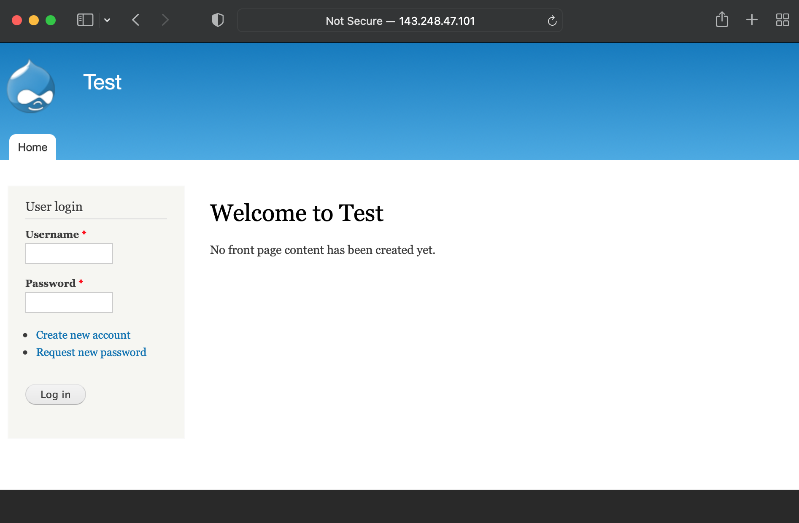
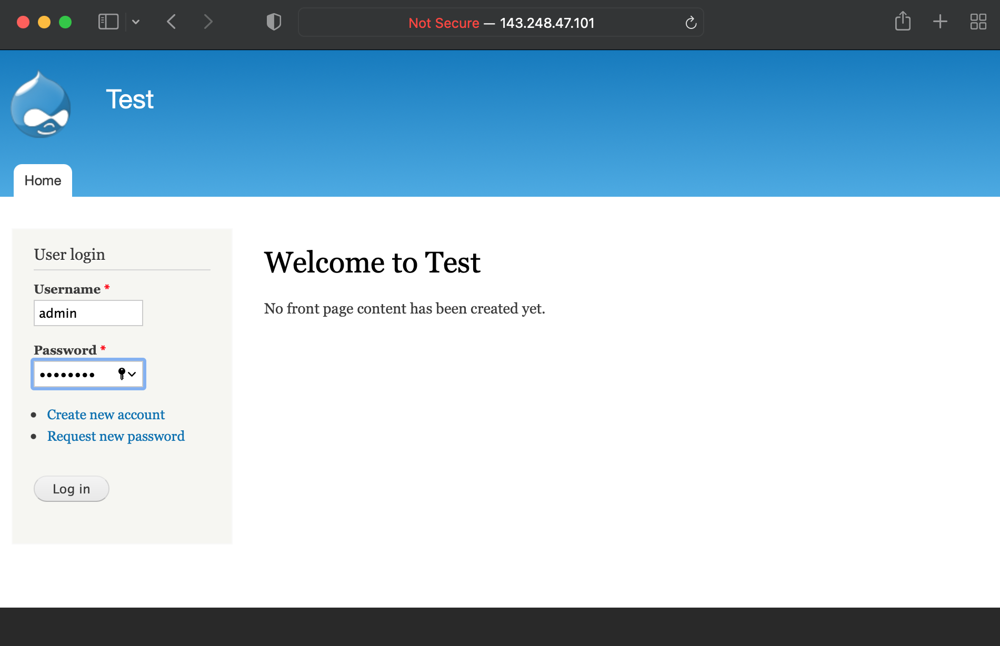
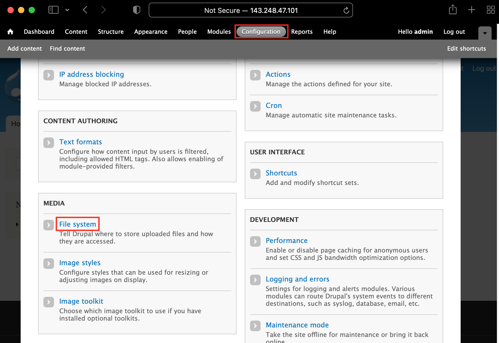
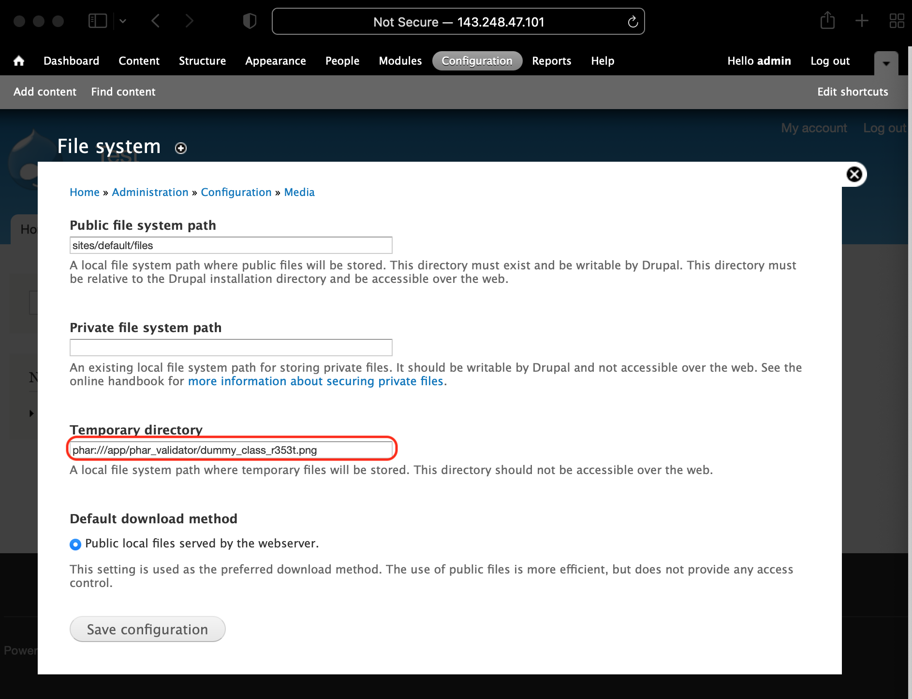

### Trigger the POI vulnerability of drupal 7.78

1. Enter http://143.248.47.101:7272/drupal-7.78/

2. Login (Username: admin / Password: asdf1234)

3. Click Configuration -> File system, 
or enter http://143.248.47.101:7272/drupal-7.78/node?admin/config#overlay=admin/config/media/file-system

4. Enter `phar:///app/phar_validator/dummy_class_r353t.png` in `Temporary directory` field

5. Click `Save configuration`
