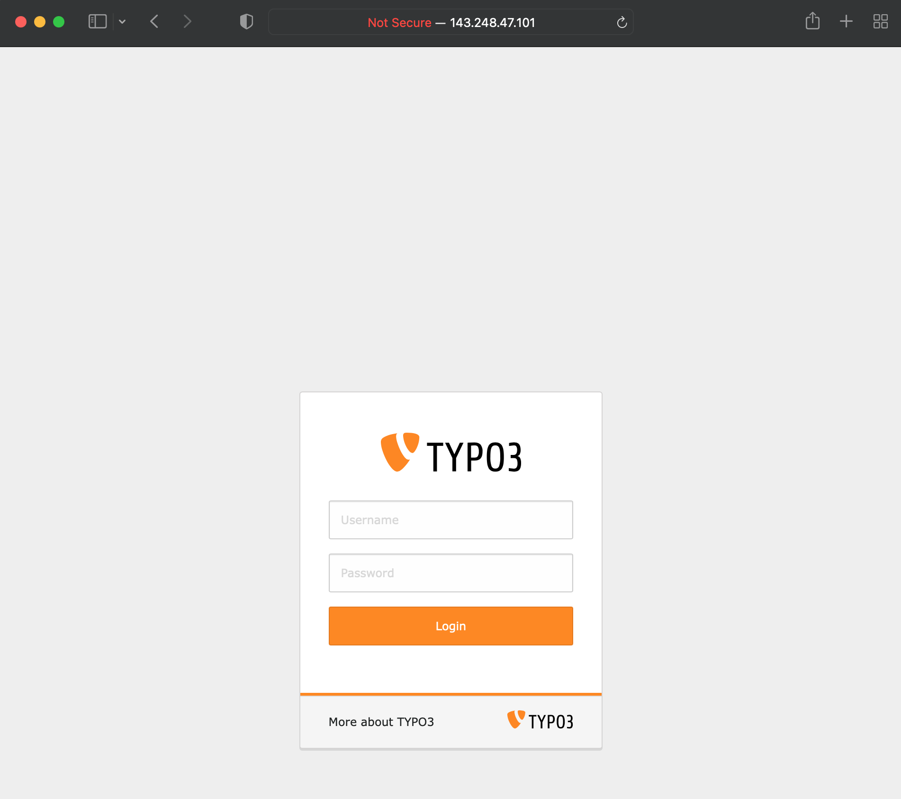
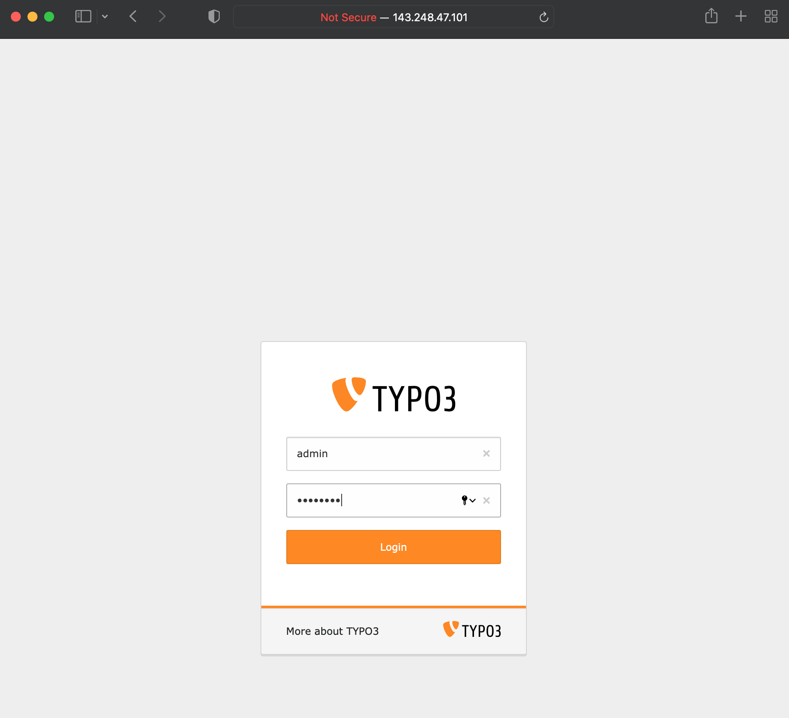
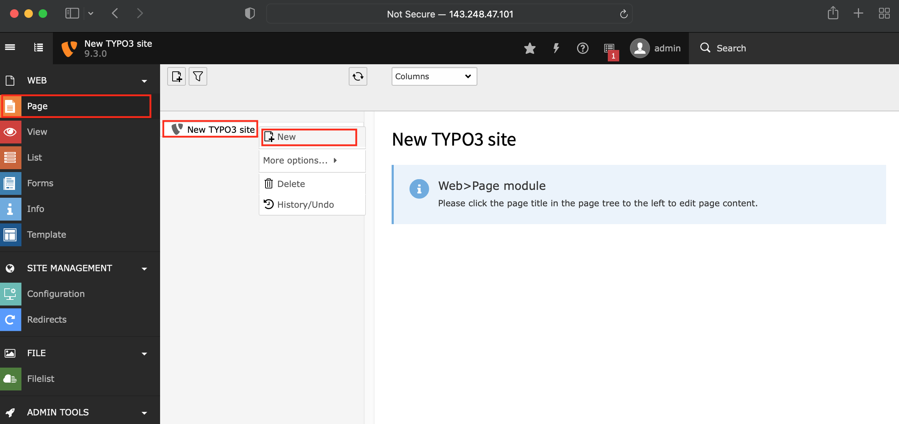
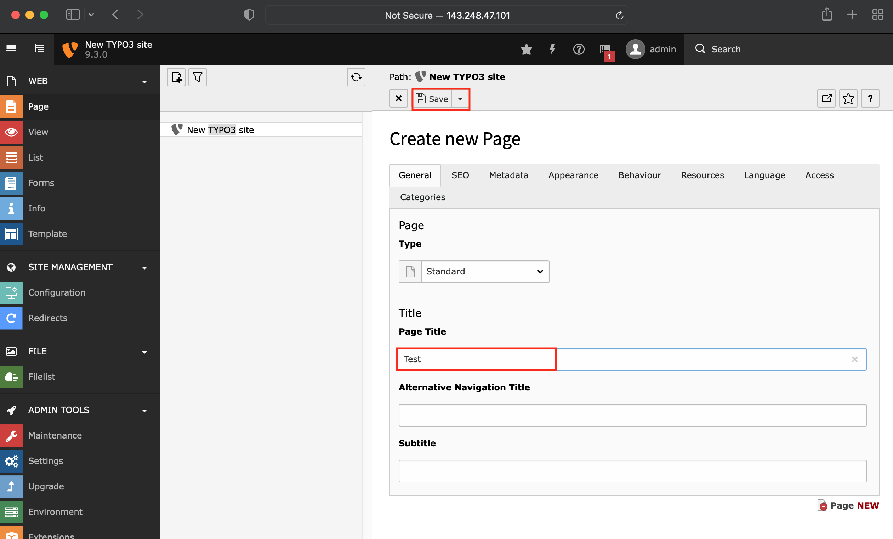
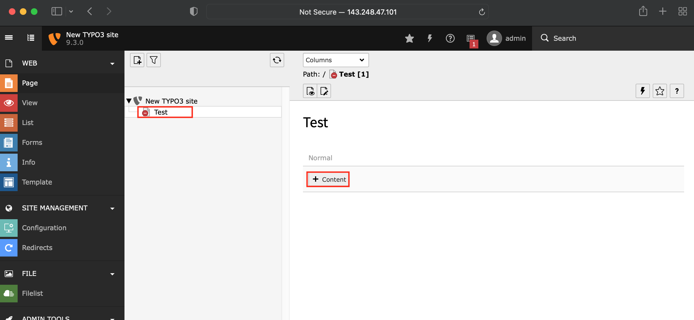
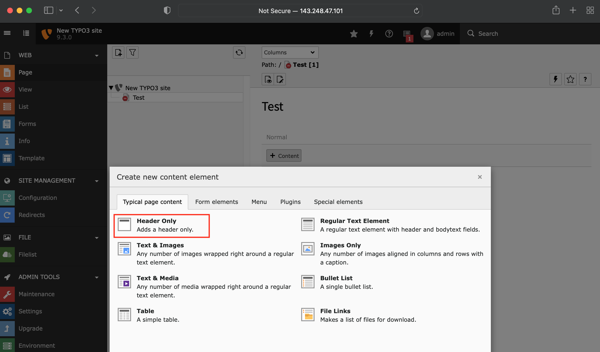

### Trigger the POI vulnerability of typo3

1. Enter http://143.248.47.101:7272/typo3_9.3.0/typo3/

2. Login (Username: admin / Password: asdf1234)

3. Click `Page` -> `New TYPO3 site` (right click) -> `New`

4. Enter any contents in `Page Title` field and click `Save`

5. Right click the generated page and click `Content` button

6. Click `Header Only` button

7. Enter `phar:///app/phar_validator/dummy_class_r353t.png` in `Link` field

8. Click `Save` button
